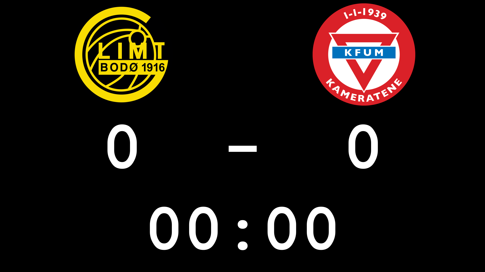

# simple-football-clock

A football match clock built for dual-monitor setups. The scoreboard goes full-screen on the secondary monitor, the controls stay on your main screen.

Built with Python + PyQt6.

## Download

**[Download latest release](../../releases/latest)** — unzip and run, no Python needed.

## What it does

- Full-screen scoreboard on the second monitor
- Clock auto-stops at 45:00 and 90:00
- Separate start buttons for 1st and 2nd half
- Resume works for injury time
- Score buttons per team
- Add your own team logos — just drop images in the `logos/` folder
- No logo? Shows **H** (Hjemmelag) and **B** (Bortelag) as placeholders

## Screenshot



## Running it

Download the zip from [Releases](../../releases/latest), unzip, drop your logos in the `logos/` folder, double-click `SportsClockApp.exe`.

## Running from source

Needs Python 3.10+ and PyQt6.

```bash
pip install PyQt6
python main.py
```

`run.bat` does the same thing and installs PyQt6 first if it's missing.

## Logos

Drop `.png`, `.jpg`, `.bmp` or `.ico` files into the `logos/` folder next to the exe, then use the **Change Logo…** buttons in the control panel.

## Building the exe

```bash
pip install PyQt6 pyinstaller
python -m PyInstaller sports_clock.spec --noconfirm --clean
```

Output ends up in `dist/SportsClockApp/`.

## Files

```
Sports-Clock/
├── main.py               # entry point, screen detection
├── clock.py              # timer logic
├── scoreboard_canvas.py  # draws the scoreboard (display window)
├── scoreboard_widget.py  # small preview in the control panel
├── display_window.py     # the full-screen window
├── control_window.py     # the control panel
├── logos/                # put team logos here
├── sports_clock.spec     # PyInstaller config
├── build.bat             # builds the exe
└── run.bat               # runs from source
```
